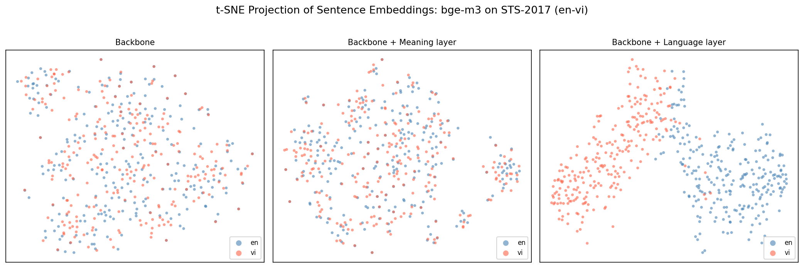
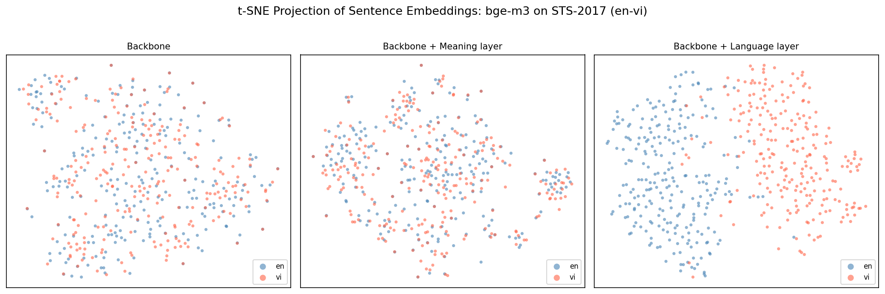
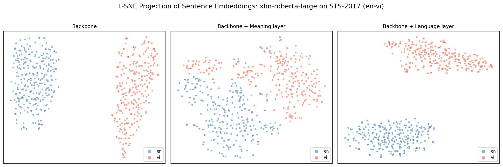
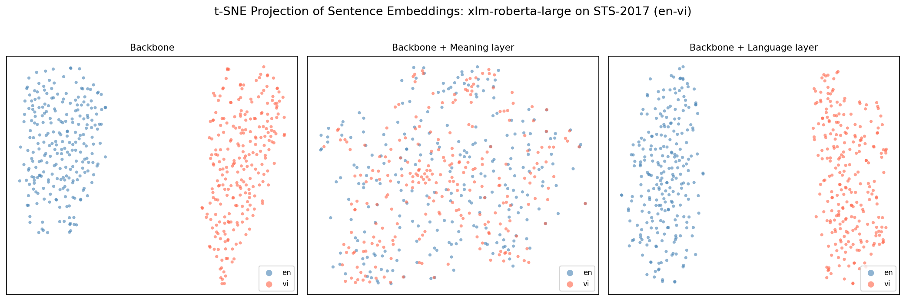

# DREAM — Disentangled Representation for Cross-lingual Meaning

A faithful PyTorch reimplementation of **Tiyajamorn et al., EMNLP 2021**:

> [*Language-agnostic Sentence Representations*](https://aclanthology.org/2021.emnlp-main.612.pdf)

The DREAM model splits a frozen multilingual sentence embedding into two disentangled subspaces — a **meaning embedding** that is language-agnostic, and a **language embedding** that captures language-specific surface features.

```
"The cat sat on the mat."        ─┐
"Le chat est sur le tapis."      ─┼─ backbone ─► DREAM ─► meaning ≈ meaning
"Die Katze saß auf der Matte."   ─┘                       language ≠ language
```

---

## Architecture

```
frozen backbone  (LaBSE / BGE-M3 / XLM-R / mBERT)
        │
        │  sentence embedding  e ∈ ℝᵈ
        ▼
  ┌──────────────────────────────────┐
  │           DREAMModel             │
  │   meaning_encoder   (Linear)   ──┼──► ê_M   language-agnostic
  │   language_encoder  (Linear)   ──┼──► ê_L   language-specific
  │   language_identifier (Linear) ──┼──► lang-id logits
  └──────────────────────────────────┘
        │
        └── Loss:  L = L_R + L_M + L_L
```

**Loss terms** (eqs. 2–11 from the paper):

| Term                            | Role                                                       |
| ------------------------------- | ---------------------------------------------------------- |
| **L_R** — Reconstruction | `ê_M + ê_L ≈ e`  (autoencoder constraint)             |
| **L_M** — Meaning        | Push parallel pairs together; push random pairs apart      |
| **L_L** — Language       | Cluster same-language embeddings + language identification |

---

## Results

**Pearson correlation · SemEval-2017 Cross-lingual STS · 4 backbones · 3 training configurations**

### Legend

- **bold** = Best in column
- ⭐ = Largest gain over backbone (avg)
- ↑ = Improved vs backbone
- ↓ = Decreased vs backbone
- (vi) = en-vi column

---

## LaBSE

*already language-agnostic by design*

| Configuration                     | en-ar    | en-de    | en-tr    | es-en    | fr-en    | it-en    | nl-en    | en-vi    | avg              |
| --------------------------------- | -------- | -------- | -------- | -------- | -------- | -------- | -------- | -------- | ---------------- |
| Backbone                          | 0.7217   | 0.7407   | 0.7294   | 0.6547   | 0.7628   | 0.7652   | 0.7502   | 0.7666   | **0.7364** |
| Backbone + DREAM (Pull Only)      | 0.6945↓ | 0.7124↓ | 0.7186↓ | 0.6559↑ | 0.7445↓ | 0.7455↓ | 0.7402↓ | 0.7339↓ | 0.7182↓         |
| Backbone + DREAM (Pull & Push)    | 0.6932↓ | 0.7140↓ | 0.7166↓ | 0.6528↓ | 0.7455↓ | 0.7473↓ | 0.7413↓ | 0.7338↓ | 0.7181↓         |
| Backbone + DREAM (Pull Only) + Vi | 0.6914↓ | 0.7106↓ | 0.7150↓ | 0.6522↓ | 0.7419↓ | 0.7444↓ | 0.7380↓ | 0.7279↓ | 0.7152↓         |

---

## BGE-M3

*strong multilingual baseline*

| Configuration                     | en-ar              | en-de            | en-tr    | es-en    | fr-en            | it-en            | nl-en            | en-vi            | avg              |
| --------------------------------- | ------------------ | ---------------- | -------- | -------- | ---------------- | ---------------- | ---------------- | ---------------- | ---------------- |
| Backbone                          | 0.7029             | **0.8183** | 0.7339   | 0.7494   | **0.7970** | **0.7887** | **0.8100** | **0.7884** | **0.7736** |
| Backbone + DREAM (Pull Only)      | **0.7399**↑ | 0.7363↓         | 0.7184↓ | 0.7209↓ | 0.7346↓         | 0.7421↓         | 0.7370↓         | 0.6974↓         | 0.7283↓         |
| Backbone + DREAM (Pull & Push)    | 0.7398↑           | 0.7341↓         | 0.7196↓ | 0.7215↓ | 0.7314↓         | 0.7406↓         | 0.7367↓         | 0.6954↓         | 0.7274↓         |
| Backbone + DREAM (Pull Only) + Vi | 0.7394↑           | 0.7320↓         | 0.7158↓ | 0.7180↓ | 0.7310↓         | 0.7387↓         | 0.7347↓         | 0.6937↓         | 0.7254↓         |

---

## XLM-RoBERTa Large

*largest improvement from DREAM*

| Configuration                     | en-ar              | en-de              | en-tr              | es-en              | fr-en              | it-en              | nl-en              | en-vi              | avg                |
| --------------------------------- | ------------------ | ------------------ | ------------------ | ------------------ | ------------------ | ------------------ | ------------------ | ------------------ | ------------------ |
| Backbone                          | 0.1908             | 0.1173             | 0.1306             | 0.0319             | 0.1623             | 0.1405             | 0.1185             | 0.0237             | 0.1144             |
| Backbone + DREAM (Pull Only)      | **0.4189**↑ | **0.4762**↑ | 0.5001↑           | **0.4542**↑ | **0.5019**↑ | 0.5382↑           | 0.5462↑           | 0.2930↑           | **0.4661**⭐ |
| Backbone + DREAM (Pull & Push)    | 0.3422↑           | 0.3635↑           | 0.3704↑           | 0.2225↑           | 0.3328↑           | 0.3664↑           | 0.4273↑           | 0.2790↑           | 0.3380↑           |
| Backbone + DREAM (Pull Only) + Vi | 0.4175↑           | 0.4743↑           | **0.4984**↑ | 0.4496↑           | 0.4975↑           | **0.5361**↑ | **0.5446**↑ | **0.4103**↑ | **0.4785**⭐ |

---

## mBERT

*bert-base-multilingual-cased*

| Configuration                     | en-ar              | en-de    | en-tr              | es-en    | fr-en              | it-en              | nl-en              | en-vi              | avg                |
| --------------------------------- | ------------------ | -------- | ------------------ | -------- | ------------------ | ------------------ | ------------------ | ------------------ | ------------------ |
| Backbone                          | 0.1999             | 0.3341   | 0.1724             | 0.2440   | 0.3355             | 0.3338             | 0.3670             | 0.3296             | 0.2895             |
| Backbone + DREAM (Pull Only)      | 0.1932↓           | 0.2835↓ | 0.2050↑           | 0.1774↓ | 0.3526↑           | 0.3803↑           | 0.3740↑           | 0.2703↓           | 0.2795↓           |
| Backbone + DREAM (Pull & Push)    | 0.1962↓           | 0.2891↓ | **0.2108**↑ | 0.1838↓ | **0.3638**↑ | **0.3884**↑ | 0.3748↑           | 0.2734↓           | 0.2850↓           |
| Backbone + DREAM (Pull Only) + Vi | **0.2017**↑ | 0.2837↓ | 0.1999↑           | 0.1846↓ | 0.3597↑           | **0.3902**↑ | **0.3806**↑ | **0.2984↓** | **0.2874**⭐ |

---

## Analysis

DREAM demonstrates the strong effectiveness of disentangling meaning and language representations, especially for weakly aligned backbones.

### Key Insights

**01. DREAM is a powerful post-hoc debiasing technique for weakly-aligned models**  
XLM-R Large and mBERT show dramatic improvements (average gains of +0.364 and +0.0079 respectively).

**02. Adding Vietnamese data brings significant benefits**  
Especially for XLM-R Large:  
- en-vi column improves by **+0.1173**  
- Overall average improves by **+0.0124**

**03. Pull Only consistently outperforms Pull & Push**  
The repulsion term in the Pull & Push variant leads to consistently lower performance across all backbones.

**04. Strong baselines show diminishing returns**  
LaBSE and BGE-M3 are already near saturation, so DREAM provides limited additional gains.

## Embedding Space Analysis via t-SNE

**Focused on the en-vi pair** (English–Vietnamese) — the most challenging low-resource pair in the benchmark.

Each figure compares three representations:
- **Backbone**: raw embedding from the multilingual encoder
- **Meaning layer**: language-agnostic semantic space
- **Language layer**: language-specific component

### 1. BGE-M3

<div align="center">

  
**Figure 1: BGE-M3 – Pull & Push (no Vietnamese data)**

  
**Figure 2: BGE-M3 – Pull Only (no Vietnamese data)**

</div>

### 2. XLM-RoBERTa Large

<div align="center">

  
**Figure 3: XLM-RoBERTa Large – Pull Only (no Vietnamese data)**

  
**Figure 4: XLM-RoBERTa Large – Pull Only + Vietnamese data**

</div>

**Summary of Observations**:
- DREAM successfully separates meaning from language-specific features.
- Adding Vietnamese data visibly improves meaning alignment in the Meaning layer for XLM-R.
- Weak backbones (XLM-R) benefit dramatically, while strong backbones (BGE-M3) already perform well.

### Summary of Visual Insights

- **DREAM works as intended**: It reliably pushes language information into the Language layer while preserving (and often improving) semantic alignment in the Meaning layer.
- **Backbone quality matters**: Strong baselines like BGE-M3 need little help; weak backbones like XLM-R benefit enormously.
- **Vietnamese data as a powerful regularizer**: For XLM-R, adding distant low-resource data visibly improves meaning alignment without harming language separation — strong evidence that targeted low-resource augmentation is an effective strategy in multilingual embedding training.

---

## Project Structure

```
dream-embed/
├── assets/
│   ├── bert-base-multilingual-cased_tsne.png
│   ├── LaBSE_tsne.png
│   └── xlm-roberta-large_tsne.png
├── configs/
│   └── train.yaml
├── data/                          # (gitignored) — see "Training | 1 - Prepare data" section below
│   ├── STS17/
│   ├── Tatoeba_Train/
│   └── Tatoeba_Val/
├── checkpoints/                   # (gitignored)
│   ├── labse/
│   ├── mbert/
│   └── xlmr/
├── notebooks/
│   └── evaluation.ipynb           # STS-2017 Pearson eval + t-SNE plots
├── scripts/
│   └── train.py                   # Training entry point (CLI)
├── src/
│   └── dream/
│       ├── __init__.py
│       ├── backbone.py            # BackboneBase abstraction + 3 adapters
│       ├── backbone_factory.py    # create_backbone() entry point
│       ├── dataset.py             # Tatoeba TSV → pre-computed tensor dataset
│       ├── loss.py                # L_R, L_M, L_L loss terms
│       ├── model.py               # DREAMModel (2-head MLP)
│       ├── pipeline.py            # DREAMPipeline — end-to-end inference API
│       └── trainer.py             # Trainer with EarlyStopping + checkpointing
├── .gitignore
├── LICENSE
├── README.md
└── requirements.txt
```

---

## Quickstart

### Installation

```bash
git clone https://github.com/yourusername/dream-embed.git
cd dream-embed
pip install -r requirements.txt
```

### Inference

```python
from dream.pipeline import DREAMPipeline

pipe = DREAMPipeline.from_pretrained(
    "checkpoints/dream_best.pt",
    backbone="sentence-transformers/LaBSE",
)

# Cross-lingual similarity
score = pipe.similarity("The cat is on the mat.", "Die Katze saß auf der Matte.")
print(score)  # ~0.88

# Batch encode — returns (N, D) numpy array
embeddings = pipe.encode(["Hello world", "Bonjour le monde", "Hola mundo"])
print(embeddings.shape)  # (3, 768)

# Similarity matrix
matrix = pipe.similarity_matrix(["Hello", "Bonjour", "Hola"])
print(matrix)  # (3, 3) cosine similarity
```

---

## Training

### 1 — Prepare data

**Step 1 — Download data**

Go to [Tatoeba](https://tatoeba.org/en/downloads), download the sentence pairs for each language pair you want, and place all TSV files into `data/Tatoeba/`:

```
data/
└── Tatoeba/
    ├── Sentence pairs in English-Arabic - 2026-03-12.tsv
    ├── Sentence pairs in English-Dutch - 2026-03-12.tsv
    ├── Sentence pairs in English-French - 2026-03-12.tsv
    ├── Sentence pairs in English-German - 2026-03-12.tsv
    ├── Sentence pairs in English-Italian - 2026-03-12.tsv
    ├── Sentence pairs in English-Spanish - 2026-03-12.tsv
    └── Sentence pairs in English-Turkish - 2026-03-12.tsv
```

> The original paper uses the 7 language pairs above. You can add more — see the note on adding new languages below.

**Step 2 — Split into train/val**

Run `scripts/split_data.py` to split each TSV into training and validation sets:

```bash
# Default: 90% train / 10% val, reads from data/Tatoeba/, writes to data/Tatoeba_Train/ and data/Tatoeba_Val/
python scripts/split_data.py

# Custom split ratio and directories
python scripts/split_data.py --src data/Tatoeba --train data/Tatoeba_Train --val data/Tatoeba_Val --val-ratio 0.1 --seed 86
```

After this step your `data/` directory should look like:

```
data/
├── Tatoeba_Train/
│   ├── Sentence pairs in English-Arabic - 2026-03-12.tsv
│   └── ...
└── Tatoeba_Val/
    ├── Sentence pairs in English-Arabic - 2026-03-12.tsv
    └── ...
```

Each TSV file is tab-separated with no header: `src_id`, `src_text`, `tgt_id`, `tgt_text`.

**Adding a new language pair**

The source language is hardcoded as English. To add a new `English-XXX` pair, open `src/dream/dataset.py` and update two dictionaries:

1. `_NAME_TO_ISO` — maps the language name as it appears in the Tatoeba filename to its ISO-639-1 code:

```python
_NAME_TO_ISO: dict[str, str] = {
    ...
    "vietnamese": "vi",   # add the name exactly as it appears in the filename
}
```

2. `DEFAULT_LANGUAGE_MAP` — assigns a unique integer ID to each language (used as the classification label by the model):

```python
DEFAULT_LANGUAGE_MAP: dict[str, int] = {
    ...
    "vi": 8,   # assign the next available integer ID
}
```

> If your source language is not English, you will need to modify the dataset code manually.

### 2 — Configure

Edit `configs/train.yaml` to set backbone, embedding dimension, batch size, and device.

### 3 — Train

```bash
# Basic run
python scripts/train.py

# Override config values
python scripts/train.py --epochs 50 --lr 5e-5 --device cuda

# Resume from checkpoint
python scripts/train.py --resume checkpoints/dream_epoch_0010.pt
```

---

## Supported Backbones

| Model                                        | `backbone_type` | `embedding_dim` | Notes                             |
| -------------------------------------------- | :---------------: | :---------------: | --------------------------------- |
| `sentence-transformers/LaBSE`              |      `st`      |        768        | Best overall multilingual quality |
| `BAAI/bge-m3`                              |      `bge`      |       1024       | Strong on Asian languages         |
| `FacebookAI/xlm-roberta-large`             |      `hf`      |       1024       | Largest; best absolute quality    |
| `google-bert/bert-base-multilingual-cased` |      `hf`      |        768        | Lightest; fastest training        |

Any model loadable via `sentence-transformers`, `FlagEmbedding`, or HuggingFace `AutoModel` is supported through the `BackboneBase` abstraction — no changes to the training code required.

To use a different backbone, implement the `BackboneBase` interface defined in `src/dream/backbone.py`, then pass your instance directly to `create_backbone()` — it will be returned as-is.

---

## Key Design Decisions

**Frozen backbone + pre-computed embeddings.** The backbone runs once before training begins. Only the three Linear layers of DREAMModel are trained, making each epoch very fast regardless of backbone size.

**`BackboneBase` abstraction.** A unified `.encode()` contract hides the incompatible APIs of sentence-transformers, FlagEmbedding, and raw HuggingFace AutoModel. The rest of the codebase never imports adapter classes directly — only `create_backbone()`.

**Synonym-safe negatives.** `_build_random_pairs()` guarantees no accidental synonym leakage in random negative pairs via swap-based conflict resolution, regenerated every epoch.

---

## Evaluation

Open `notebooks/evaluation.ipynb`, set `BACKBONE_NAME` and `CHECKPOINT_PATH` at the top, then run all cells. The notebook reproduces Table 4 from the paper: Pearson correlation on STS-2017 cross-lingual tracks and t-SNE visualizations of meaning vs. language embeddings.

---

## Reference

```bibtex
@inproceedings{tiyajamorn-etal-2021-language,
    title = "Language-agnostic Representation from Multilingual Sentence Encoders for Cross-lingual Similarity Estimation",
    author = "Tiyajamorn, Nattapong  and
      Kajiwara, Tomoyuki  and
      Arase, Yuki  and
      Onizuka, Makoto",
    booktitle = "Proceedings of the 2021 Conference on Empirical Methods in Natural Language Processing",
    month = nov,
    year = "2021",
    address = "Online and Punta Cana, Dominican Republic",
    publisher = "Association for Computational Linguistics",
    url = "https://aclanthology.org/2021.emnlp-main.612",
    pages = "7764--7774",
    abstract = "We propose a method to distill a language-agnostic meaning embedding from a multilingual sentence encoder. By removing language-specific information from the original embedding, we retrieve an embedding that fully represents the sentence{'}s meaning. The proposed method relies only on parallel corpora without any human annotations. Our meaning embedding allows efficient cross-lingual sentence similarity estimation by simple cosine similarity calculation. Experimental results on both quality estimation of machine translation and cross-lingual semantic textual similarity tasks reveal that our method consistently outperforms the strong baselines using the original multilingual embedding. Our method consistently improves the performance of any pre-trained multilingual sentence encoder, even in low-resource language pairs where only tens of thousands of parallel sentence pairs are available.",
}
```

---

## License

MIT