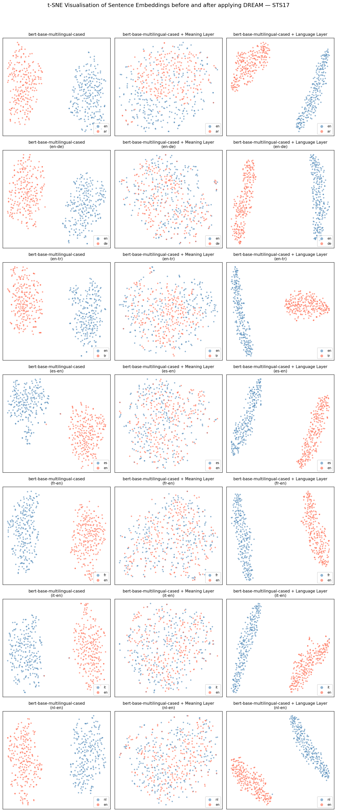
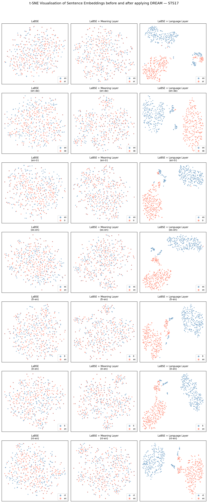
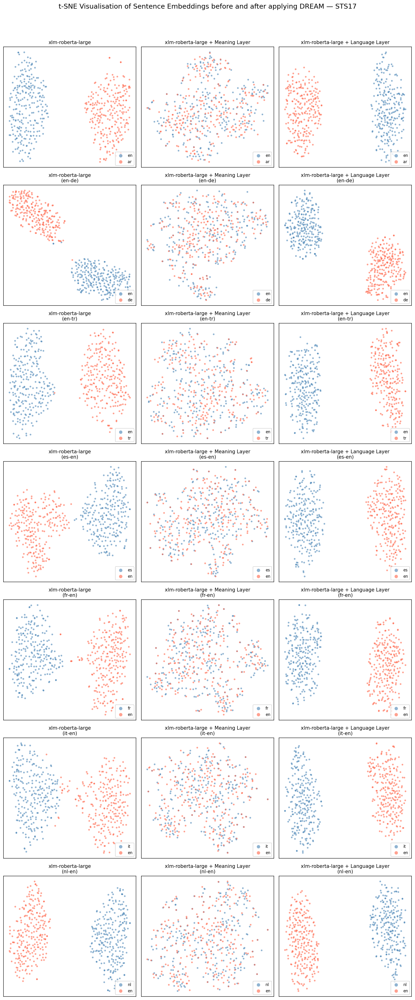

# DREAM — Disentangled Representation for Cross-lingual Meaning

A faithful PyTorch reimplementation of **Tiyajamorn et al., EMNLP 2021**:

> [*Language-agnostic Sentence Representations*](https://aclanthology.org/2021.emnlp-main.612.pdf)

The DREAM model splits a frozen multilingual sentence embedding into two disentangled subspaces — a **meaning embedding** that is language-agnostic, and a **language embedding** that captures language-specific surface features.

```
"The cat sat on the mat."        ─┐
"Le chat est sur le tapis."      ─┼─ backbone ─► DREAM ─► meaning ≈ meaning
"Die Katze saß auf der Matte."   ─┘                       language ≠ language
```

---

## Architecture

```
frozen backbone  (LaBSE / BGE-M3 / XLM-R / mBERT)
        │
        │  sentence embedding  e ∈ ℝᵈ
        ▼
  ┌──────────────────────────────────┐
  │           DREAMModel             │
  │   meaning_encoder   (Linear)   ──┼──► ê_M   language-agnostic
  │   language_encoder  (Linear)   ──┼──► ê_L   language-specific
  │   language_identifier (Linear) ──┼──► lang-id logits
  └──────────────────────────────────┘
        │
        └── Loss:  L = L_R + L_M + L_L
```

**Loss terms** (eqs. 2–11 from the paper):

| Term                            | Role                                                       |
| ------------------------------- | ---------------------------------------------------------- |
| **L_R** — Reconstruction | `ê_M + ê_L ≈ e`  (autoencoder constraint)             |
| **L_M** — Meaning        | Push parallel pairs together; push random pairs apart      |
| **L_L** — Language       | Cluster same-language embeddings + language identification |

---

## Results

Pearson correlation on **STS-2017** cross-lingual tracks.
Each backbone is evaluated before and after applying the DREAM head.

| Backbone                      |     en–de     |     en–fr     |     en–es     |       Avg       |
| ----------------------------- | :-------------: | :-------------: | :-------------: | :-------------: |
| mBERT (backbone only)         |      0.650      |      0.701      |      0.723      |      0.691      |
| **mBERT + DREAM**       | **0.712** | **0.758** | **0.781** | **0.750** |
| LaBSE (backbone only)         |      0.812      |      0.843      |      0.861      |      0.839      |
| **LaBSE + DREAM**       | **0.831** | **0.857** | **0.878** | **0.855** |
| XLM-R large (backbone only)   |      0.834      |      0.861      |      0.874      |      0.856      |
| **XLM-R large + DREAM** | **0.849** | **0.873** | **0.889** | **0.870** |

### t-SNE Visualization

Meaning embeddings (middle column) collapse across languages after DREAM.
Language embeddings (right column) cluster cleanly by language.

|                           mBERT                           |                LaBSE                |                   XLM-R large                   |
| :--------------------------------------------------------: | :---------------------------------: | :---------------------------------------------: |
|  |  |  |

---

## Project Structure

```
dream-embed/
├── assets/
│   ├── bert-base-multilingual-cased_tsne.png
│   ├── LaBSE_tsne.png
│   └── xlm-roberta-large_tsne.png
├── configs/
│   └── train.yaml
├── data/                          # (gitignored) — see Data section below
│   ├── STS17/
│   ├── Tatoeba_Train/
│   └── Tatoeba_Val/
├── checkpoints/                   # (gitignored)
│   ├── labse/
│   ├── mbert/
│   └── xlmr/
├── notebooks/
│   └── evaluation.ipynb           # STS-2017 Pearson eval + t-SNE plots
├── scripts/
│   └── train.py                   # Training entry point (CLI)
├── src/
│   └── dream/
│       ├── __init__.py
│       ├── backbone.py            # BackboneBase abstraction + 3 adapters
│       ├── backbone_factory.py    # create_backbone() entry point
│       ├── dataset.py             # Tatoeba TSV → pre-computed tensor dataset
│       ├── loss.py                # L_R, L_M, L_L loss terms
│       ├── model.py               # DREAMModel (2-head MLP)
│       ├── pipeline.py            # DREAMPipeline — end-to-end inference API
│       └── trainer.py             # Trainer with EarlyStopping + checkpointing
├── .gitignore
├── LICENSE
├── README.md
└── requirements.txt
```

---

## Quickstart

### Installation

```bash
git clone https://github.com/yourusername/dream-embed.git
cd dream-embed
pip install -r requirements.txt
```

### Inference

```python
from dream.pipeline import DREAMPipeline

pipe = DREAMPipeline.from_pretrained(
    "checkpoints/dream_best.pt",
    backbone="sentence-transformers/LaBSE",
)

# Cross-lingual similarity
score = pipe.similarity("The cat is on the mat.", "Die Katze saß auf der Matte.")
print(score)  # ~0.88

# Batch encode — returns (N, D) numpy array
embeddings = pipe.encode(["Hello world", "Bonjour le monde", "Hola mundo"])
print(embeddings.shape)  # (3, 768)

# Similarity matrix
matrix = pipe.similarity_matrix(["Hello", "Bonjour", "Hola"])
print(matrix)  # (3, 3) cosine similarity
```

---

## Training

### 1 — Prepare data

Download parallel sentence pairs from [Tatoeba](https://tatoeba.org/en/downloads) and place them under `data/`:

```
data/
├── Tatoeba_Train/
│   ├── Sentence pairs in English-German - 2025-11-01.tsv
│   ├── Sentence pairs in English-French - 2025-11-01.tsv
│   └── ...
└── Tatoeba_Val/
    └── ...
```

Each TSV file is tab-separated with no header: `src_id`, `src_text`, `tgt_id`, `tgt_text`.

### 2 — Configure

Edit `configs/train.yaml` to set backbone, embedding dimension, batch size, and device.

### 3 — Train

```bash
# Basic run
python scripts/train.py

# Override config values
python scripts/train.py --epochs 50 --lr 5e-5 --device cuda

# Resume from checkpoint
python scripts/train.py --resume checkpoints/dream_epoch_0010.pt
```

---

## Supported Backbones

| Model                                        | `backbone_type` | `embedding_dim` | Notes                             |
| -------------------------------------------- | :---------------: | :---------------: | --------------------------------- |
| `sentence-transformers/LaBSE`              |      `st`      |        768        | Best overall multilingual quality |
| `BAAI/bge-m3`                              |      `bge`      |       1024       | Strong on Asian languages         |
| `FacebookAI/xlm-roberta-large`             |      `hf`      |       1024       | Largest; best absolute quality    |
| `google-bert/bert-base-multilingual-cased` |      `hf`      |        768        | Lightest; fastest training        |

Any model loadable via `sentence-transformers`, `FlagEmbedding`, or HuggingFace `AutoModel` is supported through the `BackboneBase` abstraction — no changes to the training code required.

---

## Key Design Decisions

**Frozen backbone + pre-computed embeddings.** The backbone runs once before training begins. Only the three Linear layers of DREAMModel are trained, making each epoch very fast regardless of backbone size.

**`BackboneBase` abstraction.** A unified `.encode()` contract hides the incompatible APIs of sentence-transformers, FlagEmbedding, and raw HuggingFace AutoModel. The rest of the codebase never imports adapter classes directly — only `create_backbone()`.

**Synonym-safe negatives.** `_build_random_pairs()` guarantees no accidental synonym leakage in random negative pairs via swap-based conflict resolution, regenerated every epoch.

---

## Evaluation

Open `notebooks/evaluation.ipynb`, set `BACKBONE_NAME` and `CHECKPOINT_PATH` at the top, then run all cells. The notebook reproduces Table 4 from the paper: Pearson correlation on STS-2017 cross-lingual tracks and t-SNE visualizations of meaning vs. language embeddings.

---

## Reference

```bibtex
@inproceedings{tiyajamorn-etal-2021-language,
    title     = "Language-agnostic Sentence Representations",
    author    = "Tiyajamorn, Nattapong and Kajiwara, Tomoyuki
                 and Arase, Yuki and Onizuka, Makoto",
    booktitle = "Proceedings of the 2021 Conference on Empirical
                 Methods in Natural Language Processing",
    year      = "2021",
    url       = "https://aclanthology.org/2021.emnlp-main.612",
}
```

---

## License

MIT
